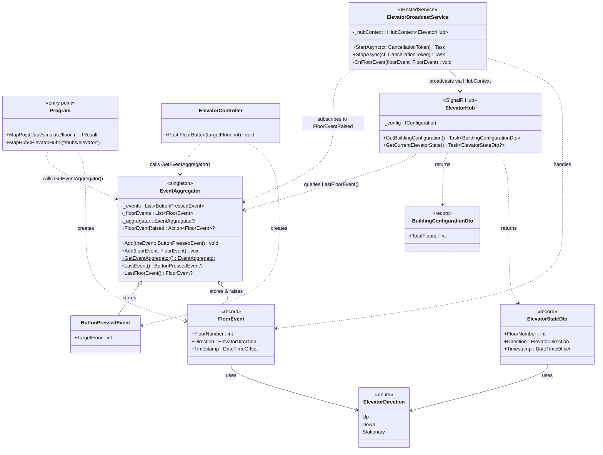
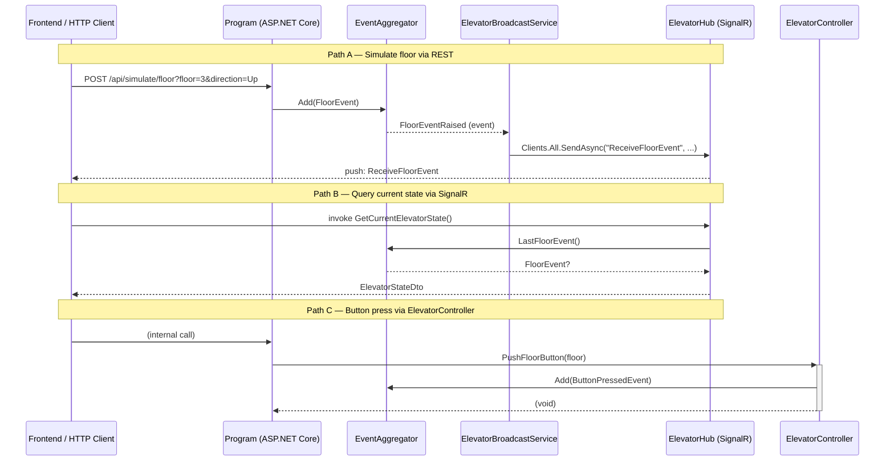

# EventElevator Backend — Architecture

## Class Diagram

## Event Flow

## Design Patterns

| Pattern | Where used |
|---|---|
| **Singleton** | `EventAggregator.GetEventAggregator()` — single global event store |
| **Observer** | `EventAggregator.FloorEventRaised` → `ElevatorBroadcastService.OnFloorEvent` |
| **Hub/Push** | `ElevatorBroadcastService` broadcasts via `IHubContext<ElevatorHub>` to all SignalR clients |
| **DTO** | `BuildingConfigurationDto`, `ElevatorStateDto` decouple internal events from the wire contract |
| **Hosted Service** | `ElevatorBroadcastService : IHostedService` wires the observer on startup and cleans up on stop |
